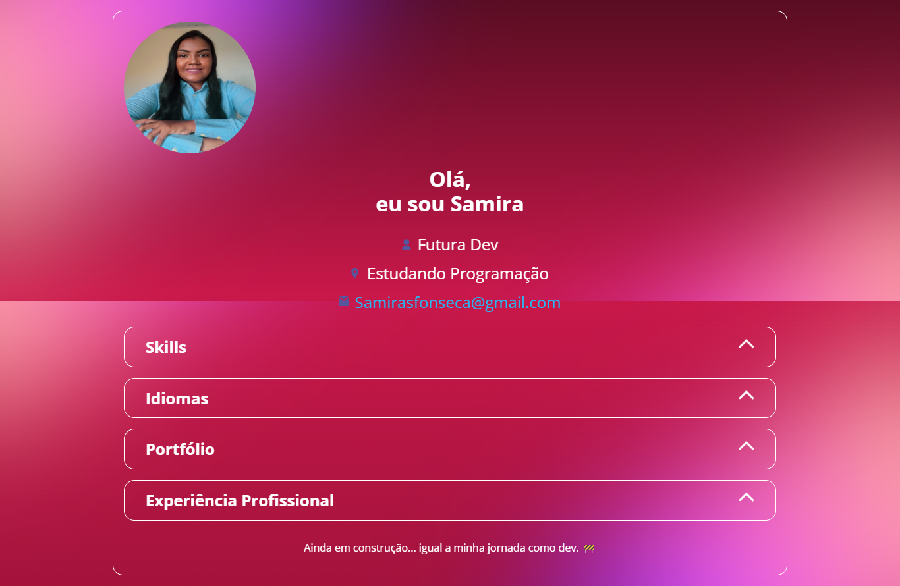

# 🌟 Portfólio Samira Santos

## 🔗 **Acesse o portfólio online:** [Clique aqui](https://samirasfonseca.github.io/Portfolio2/)

> Repositório do meu portfólio pessoal como desenvolvedora Front-End em formação. Este projeto apresenta minhas habilidades, experiências e principais projetos realizados com HTML, CSS e JavaScript.

---

## 🚀 Tecnologias Utilizadas

---

## 🧠 Funcionalidades

- Interface moderna e responsiva
- Acordeões interativos para navegação entre seções
- Dados dinâmicos carregados via JSON
- Links diretos para projetos hospedados no GitHub
- Destaque para soft skills, hard skills e idiomas

---

## 📂 Estrutura do Projeto

├── assets/
│ ├── css/ # Estilos divididos por seções
│ ├── img/ # Imagens e ícones
│ └── js/ # Scripts JavaScript
├── data/
│ └── profile.json # Dados de perfil (nome, skills, etc.)
├── index.html # Página principal do portfólio
└── README.md # Documentação do projeto

---

## 🎯 Projetos no Portfólio

| Projeto | Link |
|--------|------|
| 📺 Landing Page no Mundo Invertido | [Ver no GitHub](https://github.com/samirasfonseca/LANDING-PAGE-MUNDO-INVERTIDO) |
| 📺 Clone da Página do YouTube | [Ver no GitHub](https://github.com/samirasfonseca/PROJETO-CLONANDO-UM-PAGINA-DO-YOUTUBE) |
| 🎬 Landing Page The Boys | [Ver no GitHub](https://github.com/samirasfonseca/landing-page-the-boys) |
| 🌓 Formulário Modo Dark/Light | [Ver no GitHub](https://github.com/samirasfonseca/Formul-rio-Modo-DARK-e-LIGHT) |
| 🍔 Landing Page Restaurante | [Ver no GitHub](https://github.com/samirasfonseca/Landing-page-Gastronomia) |
| 🌐 Clone da Landing Page Discord | [Ver no GitHub](https://github.com/samirasfonseca/PROJETO-DIO-CLONANDO-UMA-PAGINA-DO-DISCORD) |
| 🧱 Jogo Detona Ralph | [Ver no GitHub](https://github.com/samirasfonseca/PROJETO-JOGO-DETONA-RALPH) |
| 🎹 Piano Virtual | [Ver no GitHub](https://github.com/samirasfonseca/PROJETO-DIO-PIANO-VIRTUAL) |

---

📬 Contato
Email: samirasfonseca@gmail.com

LinkedIn: [linkedin.com/in/samira-santos](https://www.linkedin.com/in/samira-santos-92364911a/) 

🚧 Status
Projeto em constante evolução... assim como minha jornada como dev. 👩‍💻💪